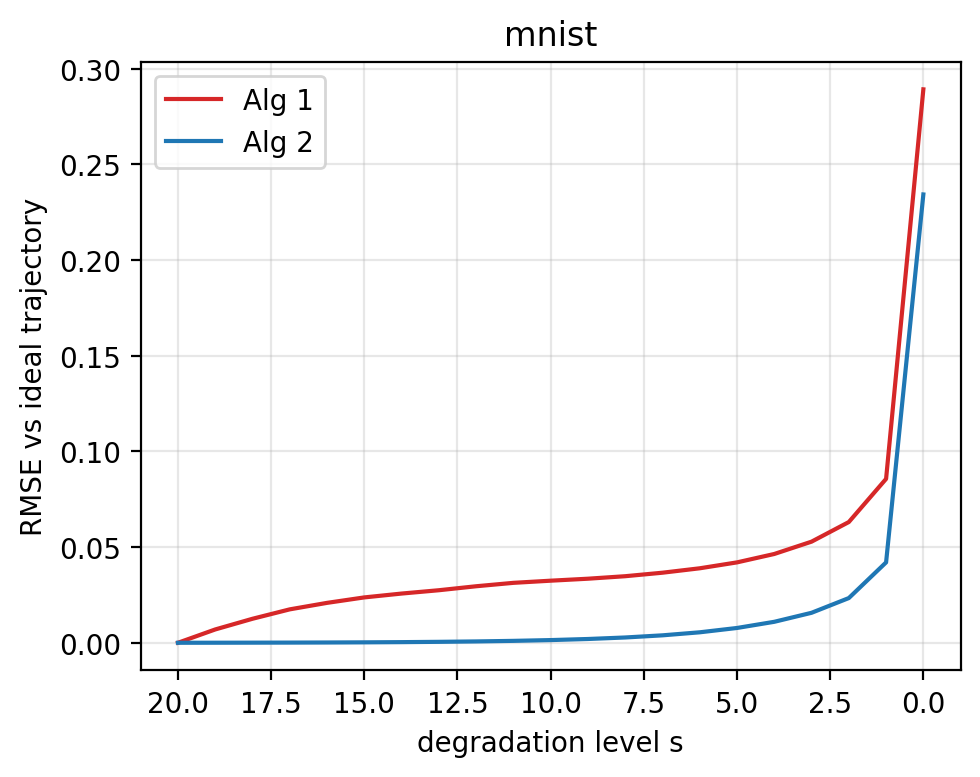
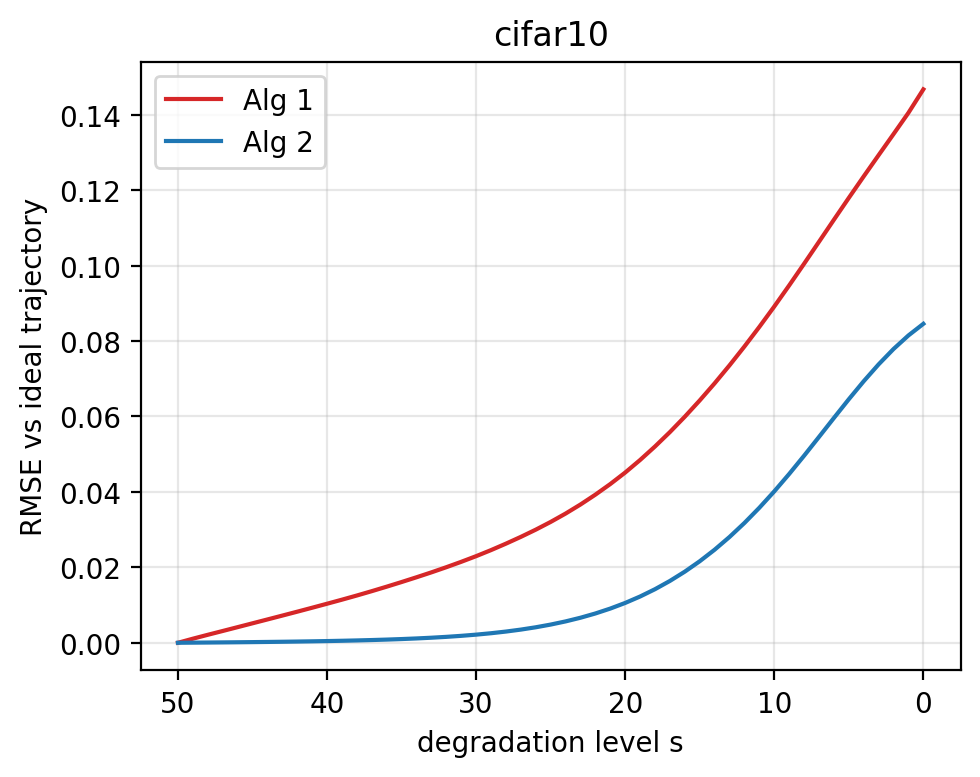

# Cold Diffusion: Deblurring without Noise

CS 4782 (Spring 2026) Final Project — Cornell University

## Introduction

This repository is a re-implementation of **"Cold Diffusion: Inverting Arbitrary Image Transforms Without Noise"** (Bansal et al., 2022). The paper's main contribution is showing that generative diffusion models do not require Gaussian noise: any deterministic, invertible image degradation (blur, masking, downsampling, …) can power a diffusion process, if the reverse step is trained as a restoration network. Our project reproduces their **deblurring** version and tests the stability of their two sampling algorithms.

## Chosen Result

We target **Table 1, Section 4.1** of the paper — the deblurring quality comparison on MNIST, CIFAR-10, and CelebA across three conditions:

- **Degraded** — the blurry input (baseline)
- **Direct** — one-shot reconstruction `R(D(x₀, T), T)`
- **Sampled** — iterative reconstruction via Algorithm 2

Metrics: **FID, SSIM, RMSE**. The key trend to reproduce: *Sampled* improves FID over *Direct*, while *Direct* wins on per-pixel SSIM/RMSE. We additionally provide a stability comparison between **Algorithm 1** (naive) and **Algorithm 2** (improved), which the paper does not report for deblurring.

## GitHub Contents

```
code/         U-Net, blur degradation, sampling (Alg 1/2), training, evaluation, generation
data/         Dataset loaders (MNIST, CIFAR-10, CelebA)
notebooks/    01_table1.ipynb     — Table 1 reproduction
              02_stability.ipynb  — Algorithm 1 vs 2 comparison
              train_*.ipynb       — training notebooks per dataset
poster/       Poster PDF and source
requirements.txt
```

## Re-implementation Details

- **Model:** U-Net with residual blocks, attention, and skip connections (`code/model.py`).
- **Degradation:** Gaussian blur with per-dataset schedules (`code/degradation.py`):
  - MNIST: 11×11 kernel, T=20, σ=7.0 (constant)
  - CIFAR-10: 11×11, T=50, σ=0.01·t+0.35 (reflect pad)
  - CelebA: 15×15, T=200, σ=exp(0.01·t) (reflect pad)
- **Training:** Adam, lr=2e-5, batch 32 with 2× gradient accumulation, L1 loss, EMA decay 0.995 (updated every 10 steps). Reduced to 100k steps from the paper's 700k due to compute.
- **Sampling:** Both Algorithm 1 and Algorithm 2 implemented in `code/sampling.py`.
- **Evaluation:** FID , SSIM, RMSE in `code/evaluate.py`.
- **Challenges / Modifications:** Reduced training horizon and batch size for Colab Pro single-GPU runs; omitted Celeb A due to high resolution 128×128 due to compute issues.

## Reproduction Steps

1. Clone the repo and install dependencies (Python 3.11+ recommended):
   ```bash
   pip install -r requirements.txt
   ```
2. Train a model (or open the corresponding notebook in `notebooks/`):
   ```bash
   python code/train.py --dataset mnist     # or cifar10 / celeba
   ```
3. Reproduce Table 1:
   ```bash
   jupyter notebook notebooks/01_table1.ipynb
   ```
4. Reproduce the stability comparison:
   ```bash
   jupyter notebook notebooks/02_stability.ipynb
   ```

**Compute:** All experiments were run on Google Colab Pro with a single A100 GPU. MNIST trains in around 10 hour; CIFAR-10 about 20h.

## Results / Insights

**Table 1 reproduction — held-out test set, lower is better:**

| Dataset  | Method              | FID (Ours) | SSIM (Ours) | RMSE (Ours) | FID (Paper) | SSIM (Paper) | RMSE (Paper) |
|----------|---------------------|-----------:|------------:|------------:|------------:|-------------:|-------------:|
| MNIST    | Degraded (x_T)      | 398.14     | 0.0141      | 0.2866      | 438.59      | 0.2870       | 0.2870       |
| MNIST    | Direct R(x_T, T)    | 27.04      | **0.8458**  | **0.1358**  | 5.10        | 0.7570       | 0.1420       |
| MNIST    | Alg 1 naive iter.   | 41.16      | 0.6234      | 0.2374      | —           | —            | —            |
| MNIST    | **Alg 2 improved**  | **22.69**  | 0.7537      | 0.1780      | 4.69        | 0.7180       | 0.1540       |
| CIFAR-10 | Degraded (x_T)      | 313.65     | 0.3562      | 0.1359      | 298.60      | 0.3150       | 0.1360       |
| CIFAR-10 | Direct R(x_T, T)    | 58.33      | **0.6736**  | **0.0810**  | 83.69       | 0.7750       | 0.0710       |
| CIFAR-10 | Alg 1 naive iter.   | 96.42      | 0.5188      | 0.1205      | —           | —            | —            |
| CIFAR-10 | **Alg 2 improved**  | **55.75**  | 0.6634      | 0.0826      | 80.08       | 0.7730       | 0.0750       |

We reproduce the paper's qualitative trend: **Algorithm 2 sampling yields the lowest FID, while Direct reconstruction wins on pixel-wise SSIM / RMSE.** Absolute numbers differ from the paper because we trained for far fewer steps. The stability experiment clearly shows Algorithm 1 drifting and accumulating artifacts at long horizons, while Algorithm 2 remains stable — visible in the intermediate-step grids in `02_stability.ipynb`.

**Forward → reverse visual comparison (Direct · Alg 1 · Alg 2):**

| Dataset  | x₀ | D(x₀, T/2) | x_T | Direct | Alg 1 | Alg 2 |
|----------|----|------------|-----|--------|-------|-------|
| MNIST    |  |  |  |  |  |  |
| CIFAR-10 |  |  |  |  |  |  |

**Drift over sampling — Algorithm 1 vs Algorithm 2 (RMSE vs ideal trajectory):**

| MNIST | CIFAR-10 |
|-------|----------|
|  |  |

Algorithm 1 (red) drifts as restoration error compounds; Algorithm 2 (blue) stays close to the manifold at every degradation level on both datasets — confirming the compounding-error theory of §3.3.

## Conclusion

Re-implementing Cold Diffusion confirmed that noise is not special: a deterministic blur process is enough to train a generative restoration model. The biggest practical lessons were (1) the FID-vs-SSIM tradeoff between Direct and Sampled is robust even at low training budgets, and (2) Algorithm 2's fixed-point-style update is what makes long-horizon deblurring tractable — Algorithm 1 visibly degrades.

## References

- Bansal et al., *Cold Diffusion: Inverting Arbitrary Image Transforms Without Noise.* arXiv:2208.09392 (2022).
- Ho et al., *Denoising Diffusion Probabilistic Models.* NeurIPS 2020.
- Official reference repo: https://github.com/arpitbansal297/Cold-Diffusion-Models
- Datasets: MNIST, CIFAR-10, CelebA

## Acknowledgements

This project was completed as the final project for **CS 4782: Introduction to Deep Learning** at Cornell University, Spring 2026. It was graded by the course staff and peer reviewed.

**Team:**
- Julius Samwer (jcs557) — U-Net architecture
- Kevin Rodriguez (kjr64) — Degradation operator
- Nicky Josephson (noj5) — Datasets and data loading
- Tudor Braicu (tb574) — Sampling, evaluation, generation
